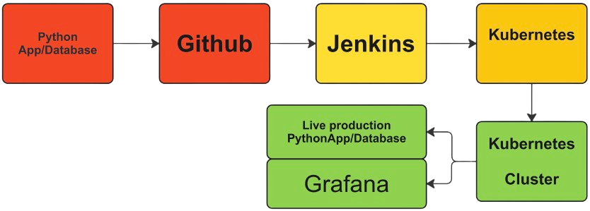
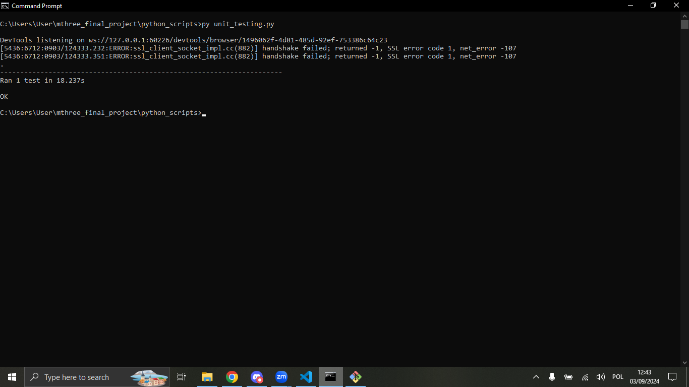

# Income Tax Calculator App 

Project Authors: Marceli Ciesielski, John Dela Cruz, Eduar Mancera
This project was submitted as a final project assignment at the mthree academy training on the 6th of September 2024.

In this personal ReadMe I describe my own understanding of the project as a whole and elaborate in greater detail about my own contributions and the challenges that I encountered.

## Project Members' Main Contributions

Marceli Ciesielski --> HTML, CSS, Python App, JSON API, Selenium testing, Dockerfile, Grafana, Prometheus, Github.
John Dela Cruz --> EC2 instance management, Kubernetes, Jenkins, Dockerhub, SQLLite, Grafana, Github.
Eduar Mancera --> Project Management, Flowchart, Presentation, Shared ReadMe, Github, Testing.

## Table of Contents

- [Introduction](#introduction)
- [SRE_Methodologies](#sre_methodologies)
- [Front-End](#front-end)
- [Back-End](#back-end)
- [Docker](#docker)
- [Kubernetes](#kubernetes) 
- [Jenkins](#jenkins)
- [Monitoring](#monitoring)
- [Testing](#testing)
- [Challenges_encountered](#challenges_encountered)

## Introduction

This app provides a simple income tax calculator with a user-friendly interface to collect and process user information. The data entered by the user is processed by a Python script on the server side, with the results saved in a database and displayed back to the user. While the web-app's functionality is straightforward, it is supported by a robust and multi-level infrastructure designed for scalability, continuous integration, and monitoring.

The application is containerized using Docker, ensuring consistency across development, testing, and production environments. The deployment process is managed using Kubernetes, which orchestrates the containers, providing high availability and scalability. Jenkins is integrated into the setup to automate the build, and deployment pipelines, enabling continuous integration and delivery. Additionally, Prometheus and JSON APIs are used to update the Grafana dashboard, which is used for real-time monitoring of the application and the EC2 instance it is running on. 

The general underlying structure is shown in the flowchart below:

## SRE_Methodologies

For the purpose of this project we have used several SRE methodologies to ensure that we have control over the development and implementation process. We intended to adhere to the following SRE principles:
1. Embracing risk (Agile approach)
2. Service Level Objectives (Budget consideration, Meetings, Kanban)
3. Eliminate Toil (Jenkins pipeline)
4. Monitor Distributed Systems (Monitoring dashboard with Grafana, Prometheus etc.)
5. Automation (Jenkins pipeline)
6. Release Engineering (Github)
7. Simplicity 

Our implementation involved the following solutions:
1. Github Repository - this provides version control and allows for receiving code updates from others in a timely and organised manner.
2. Kanban Dashboard - this helped us define and manage our backlog and tasks.
3. Discord group - this facilitated the communication and coding between the group members
4. Regular Meetings - this facilitated the communication between the group members.
5. Agile Methodologies - this allowed us to break the project down into manageable sprints, focus and adapt on upcoming and unexpected challenges enabling iterative development and continuous delivery. 
6. Monitoring & Alerts - this provided us with real-time visibility into the health and performance of our application.
7. Budget consideration - this helped us choose development resources that allowed us to build a functioning application, while limiting the spending. 
8. Monitoring tools - this helped us be aware of the state of our application

## Front-End

The front-end of the application consists of simple HTML and CSS files found in /python_scripts/templates and /python_scripts/static respectively. These two provide a basic and user-friendly interface to communicate with the user and send the information provided through an HTML form to the backend script.

## Back-End

The back-end of the application is located in a single file found in /python_scripts/app.py. This Flask app script consists of the following steps:
1. Initialising the SQL lite database 
The SQLLite was chosen in place of a separate MySQL server due to limited resources. Since running all computationally heavy services like Jenkins, Kubernetes, Docker etc. has already forced us to use multiple instances and one stronger paid instance on AWS, we wanted to limit further complication and settled for a convenient solution like SQLLite. The database consists of a single table with the following schema:

2. Handling user input securely
Next the code escapes any suspicious characters from the user string input and validates if the numerical inputs are valid. This is necessary to avoid Cross Site Scripting and SQL injection type of attacks.
3. Calculating tax
4. Putting the calculated results into a database.
5. Method for relaying the results back to the user in the interface using the result.html file. 
6. Method for putting the contents of the table into a JSON API, which is later used in Grafana.

## Docker

As mentioned in the introduction, the app is containerised using Docker. This is done to (among others) ensure a consistent environment across platforms as well as for facilitated automation through Jenkins later. The main two elements of that are the Dockerfile and the requirements.txt files, both stored in the python_scripts directory. The latter contains the necessary libraries and their versions that Docker will need to install before running the application. The former contains the instructions to build the docker image. The structure of our dockerfile is self-explanatory, as it defines the version of python used for the backend, installs the required libraries, exposes port 5000 for communication and runs the flask application.

## Kubernetes

For the purpose of this project we have decided on using minikube as our kubernetes service. Minikube is a lightweight tool that allows for running a single-node Kubernetes cluster on a single AWS ec2 instance. This decision was made to save the resources and the time it would take to build a full-blown Kubernetes cluster. 

The two files found in the repository that correspond to minikube can be found in minikube/deployment.yaml and minikube/service.yaml. The two files are respectively responsible for deploying our application by creating a pod that runs the docker container and for exposing the application running in the pod to external traffic. 

## Jenkins

Jenkins is implemented in this application primarily for automating the build process. Our jenkinsfile is found in the Jenkins folder located in the main directory. As with the dockerfile, the Jenkins file is quite self-explanatory. It consists of the following steps:
1. Building the Docker image
2. Pushing the Docker image to Dockerhub - this had to be done because minikube is set up to use images from Dockerhub
3. Minikube deployment

Naturally the use of Jenkins in this project could be expanded, since Jenkins could also provide automated testing. Such scripts were created and are discussed in a later section, but for simplicity and time constraints the testing scripts have not been included in the jenkinsfile at this point. The image below shows the sample jenkins log.

## Monitoring

Monitoring is a vital part of SRE, therefore we implemented it in this application. For this purpose we used JSON API, Node Exporter, Prometheus and Grafana to ultimately build a monitoring dashboard seen below. Monitoring was implemented on a separate EC2 instance from the one, where kubernetes, jenkins, docker and the app are running. This is done not only because of an already significant pressure on the resources of that instance, but also to ensure that the monitoring instance is independent from what it monitors.

1. Installed or set up on the monitored instance
- Json API - this is a part of the python app and it allows for access to records stored in the database in JSON format.
- Node Exporter - this is installed on the ec2 instance where the actual app is deployed. It allows Prometheus to obtain data about the instance to monitor its state. (Installation described in the prometheus_setup.txt)

2. Installed on the monitoring instance
- Prometheus - this is a typical monitoring toolkit for containerised applications. It is what captures the information from the Node exporter and then forwards it to Grafana to become a part of the dashboard. (Installation described in the prometheus_setup.txt)
- Grafana - this is a tool that we used to make the final dashboard. We plugged the JSON API and the Prometheus as our data sources and created several monitoring visualizations on the dashboard. 

The dashboard in itself could be expanded to an enormous size due to the huge amount of information coming from the Node Exporter. Ultimately we used two types of data:
- Data from JSON API - On our dashboard we created a table that is automatically updated when new entries are submitted in the app. It was necessary to use additional data transformations in the JSON API in grafana to ensure the JSON data was correctly interpreted.
- Data from Node Exporter/Prometheus - On our dashboard we created several visualisations that we believe would be useful in monitoring the health and operations of the instance. Those metrics included the available memory, number of times the network has dropped, CPU usage per node, Network Packet rate, instance temperature. 

As mentioned before the dashboard could be widely expanded (as the Node Exporter provides much more data), but in order to save time and money connected to keeping the instances running it was constrained to only those metrics that we deemed the most vital. The image below shows what the dashboard looked like at the end.

## Testing

While developing the infrastructure we ensured that on each expansion, the operation of the whole app is being manually tested. In addition we also wrote the unit-testing code that can test if the application is working correctly from the user perspective. The code can be found in python_scripts/unit_testing.py. To effectively prepare such a test we used the selenium library in python. This allows for automating a web browser and simulating the user's experience in the web app. The test first accesses the web app through http and finds the form elements and tries to make a valid submission in the form. Then it checks if the result webpage is returned correctly. It is thereby able to do a quick check on whether the web app is working correctly from the user's perspective.

It would be possible to integrate such a test within Jenkins and this should be considered when discussing potential improvement and expansion of our project.

The image below shows the selenium output if the test is working correctly (two error messages on top should be ignored as they refer to insecure connection through http, not https and have no relevance to the functioning of the app).

## Challenges_encountered

Naturally, as we worked on the project we ran into numerous issues. Therefore in this section I would like to discuss some of these challenges and how we managed to overcome them.
- EC2 instance limitations: The freely available AWS EC2 instances are characterised by scarce resources. In this case they wouldn't allow us to run multiple computationally heavy services like Kubernetes, Docker and Jenkins. Consequently we were faced with a choice - to split all the services into separate instances and manage the complex connections between them, or settle for a more powerful paid instance to run most of the services on a single instance. Ultimately we settled for the latter, but ensured to run the instance only when necessary to adhere to the cost minimisation principle. This allowed us to run the whole app on a single powerful instance and the monitoring on a separate free instance.
- Deploying Docker on minikube: Initially we intended to deploy a local container on minikube, but it was proving difficult since the minikube is configured to get images from the Dockerhub, so ultimately the Jenkins script was expanded to deploy the image on Dockerhub before deploying minikube.
- Handling data of an untypical JSON format on Grafana: While grafana is very well designed to automatically find elements in the Prometheus structure, it wasn't doing so with our JSON API. We needed to apply manual transformations of the data to make it accessible on the dashboard.
- Github limitations for large files: Our kubernetes setup contained numerous large files that were necessary to run our app, however those files are too large to be put on github - thus hindering our ability to provide the reader/github user with an easy way to run the whole of our infrastructure. In the end we leave the configuration to the user, but we provide the service and deployment files which are the most essential files used to connect with the rest of the infrastructure.
- AWS EC2 Security groups: By default the AWS instances don't have many of the ports enabled, therefore when setting up this project, one must ensure that all relevant ports are enabled for inbound traffic.
- Setting up monitoring alerts: It would certainly be useful to set up alerts related to unusual behaviour of any of the monitored stats. However due to lack of time, those were not yet implemented.
